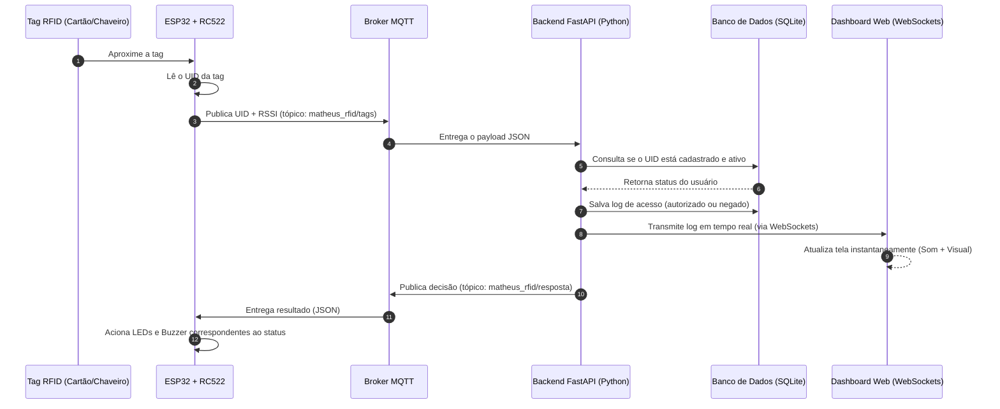

# Sistema de Controle de Acesso RFID com ESP32, MQTT e FastAPI

Este documento descreve detalhadamente o funcionamento, arquitetura, conexões físicas e passos de configuração do sistema de controle de acesso RFID de ponta a ponta.

---

## 1. Visão Geral do Sistema

O sistema é uma solução completa de controle de acesso baseada em RFID. Ele integra hardware IoT, comunicação de baixa latência em tempo real, banco de dados relacional e uma dashboard interativa na web.

O fluxo básico do sistema ocorre da seguinte forma:



---

## 2. Esquema de Ligações de Hardware

O leitor **RFID-RC522**, os LEDs indicadores e o buzzer de feedback sonoro devem ser conectados ao **ESP32** conforme as tabelas a seguir.

### 2.1 Conexões do Leitor MFRC522 (Barramento SPI)

| Pino RC522 | Função | Pino ESP32 (GPIO) | Observações |
| :--- | :--- | :--- | :--- |
| **SDA (SS)** | Serial Data / Chip Select | **GPIO 5** | Pino de controle do barramento SPI |
| **SCK** | Serial Clock | **GPIO 18** | Clock do barramento SPI |
| **MOSI** | Master Out Slave In | **GPIO 23** | Transmissão de dados SPI |
| **MISO** | Master In Slave Out | **GPIO 19** | Recepção de dados SPI |
| **RST** | Reset | **GPIO 22** | Inicialização física/Reset do chip |
| **GND** | Ground | **GND** | Referência negativa de energia |
| **3.3V** | Alimentação 3.3V | **3V3** | **ATENÇÃO:** Nunca ligue no 5V (risco de queimar o chip) |

### 2.2 Conexões de LEDs e Buzzer (Feedback de Status)

| Atuador | Pino ESP32 (GPIO) | Função | Esquema Elétrico Recomendado |
| :--- | :--- | :--- | :--- |
| **LED Verde** | **GPIO 12** | Acesso Liberado | Conectar em série com resistor de 220 $\Omega$ ou 330 $\Omega$ ao GND |
| **LED Vermelho** | **GPIO 14** | Acesso Negado / Erro | Conectar em série com resistor de 220 $\Omega$ ou 330 $\Omega$ ao GND |
| **Buzzer** | **GPIO 27** | Feedback sonoro | Buzzer ativo (5V ou 3.3V) conectado diretamente ao GPIO e ao GND |

---

## 3. Arquitetura de Software e Componentes

O projeto é dividido em três camadas principais:

### 3.1 Firmware (ESP32)

O firmware localizado na pasta `esp32/firmware/firmware.ino` é responsável por:
1. Conectar-se à rede Wi-Fi local.
2. Estabelecer e manter a conexão com o broker MQTT.
3. Inicializar o barramento SPI com pinagem explícita (`SPI.begin(18, 19, 23, SS_PIN)`) e configurar o módulo RC522 com um atraso de estabilização de `100ms`.
4. Monitorar a presença de tags RFID. Quando detectada uma tag:
   - Extrai o UID em formato hexadecimal.
   - Aplica um cooldown de leitura (3 segundos para a mesma tag) para evitar leituras duplicadas consecutivas.
   - Lê a força do sinal Wi-Fi (RSSI).
   - Envia um payload JSON para o tópico `matheus_rfid/tags`.
5. Escutar no tópico `matheus_rfid/resposta` por decisões vindas do backend.
   - Se o status for `"authorized"`, ativa o LED verde e emite 1 bipe curto (150ms).
   - Se o status for `"denied"`, ativa o LED vermelho e emite 1 bipe longo (600ms).

### 3.2 Backend (FastAPI)

O backend escrito em Python usando **FastAPI** implementa as seguintes funções:
*   **Serviço MQTT Integrado**: Utiliza a biblioteca `paho-mqtt` em segundo plano para se inscrever no tópico de leituras (`matheus_rfid/tags`). Quando recebe uma leitura, processa a regra de negócio e publica a resposta correspondente no tópico `matheus_rfid/resposta`.
*   **Banco de Dados Relacional**: Integração com SQLite através do SQLAlchemy.
*   **WebSockets**: Fornece um endpoint WebSocket para atualizar em tempo real múltiplos painéis frontend conectados simultaneamente.
*   **Endpoints HTTP (REST API)**:
    *   `GET /`: Retorna o status operacional da API.
    *   `GET /logs`: Lista todos os logs de tentativas de acesso.
    *   `POST /rfid/access-test`: Endpoint de simulação de acesso rápido para testar o sistema sem necessidade do hardware físico.
    *   `GET /users` / `POST /users`: Cadastrar, atualizar, habilitar/desabilitar e deletar usuários no banco de dados.

### 3.3 Frontend (Dashboard Web)

Um painel administrativo interativo construído em **HTML5, CSS3 e JavaScript Vanilla**.
*   **Interface**: Exibe gráficos, contadores e tabelas de logs. Apresenta alertas sonoros e cartões coloridos que mudam dinamicamente a cada nova tentativa de acesso de forma animada (verde para sucesso, vermelho para erro).
*   **Comunicação em Tempo Real**: Conecta-se à API via WebSockets. Quando a API envia uma notificação de leitura processada, o painel se atualiza em menos de 50ms, sem a necessidade de recarregar a página (polling).
*   **Gerenciador de Usuários**: Interface amigável para associar nomes a UIDs lidos e marcar usuários como ativos/inativos instantaneamente.

---

## 4. Estrutura do Banco de Dados (Tabelas)

O banco de dados SQLite (`test.db`) é estruturado em duas tabelas utilizando o SQLAlchemy:

### 4.1 Tabela `users` (Model: `User`)
Armazena as credenciais autorizadas.

| Coluna | Tipo | Restrições | Descrição |
| :--- | :--- | :--- | :--- |
| `id` | INTEGER | Primary Key, Auto-increment | Identificador único do registro |
| `name` | VARCHAR | Not Null | Nome do titular da tag |
| `rfid_uuid` | VARCHAR | Unique, Index, Not Null | UID da tag RFID (ex: `04A3F91C`) |
| `active` | BOOLEAN | Default: True | Status da credencial (Ativo/Inativo) |
| `created_at` | DATETIME | Default: UTC Now | Data de cadastro |

### 4.2 Tabela `access_logs` (Model: `AccessLog`)
Registra todas as interações e tentativas de leitura do leitor RFID.

| Coluna | Tipo | Restrições | Descrição |
| :--- | :--- | :--- | :--- |
| `id` | INTEGER | Primary Key, Auto-increment | Identificador do log |
| `uid` | VARCHAR | Not Null | UID lido pelo leitor RFID |
| `status` | VARCHAR | Not Null | Resultado da tentativa (`authorized` ou `denied`) |
| `rssi` | FLOAT | Nullable | Força do sinal Wi-Fi no momento da leitura |
| `created_at` | DATETIME | Default: UTC Now | Data e hora exata da tentativa de acesso |

---

## 5. Como Configurar e Executar o Projeto

### Passo 1: Preparar o Ambiente Backend
1. Navegue até a pasta raiz do projeto no terminal.
2. Ative o ambiente virtual Python:
   ```powershell
   .\venv\Scripts\Activate.ps1
   ```
3. Instale as dependências:
   ```bash
   pip install -r requirements.txt
   ```
4. Verifique as configurações no arquivo `.env` (exemplo de configuração padrão):
   ```env
   MQTT_HOST=broker.hivemq.com
   MQTT_PORT=1883
   MQTT_TOPIC=matheus_rfid/tags
   MQTT_RESPONSE_TOPIC=matheus_rfid/resposta
   DATABASE_URL=sqlite:///./test.db
   ```

### Passo 2: Executar o Backend
Inicie a API com recarregamento automático (reload):
```bash
python -m uvicorn api.main:app --reload
```
A API estará rodando em `http://127.0.0.1:8000`. A documentação Swagger estará em `http://127.0.0.1:8000/docs`.

### Passo 3: Executar a Dashboard
Basta dar um duplo clique no arquivo index.html localizado no diretório `/dashboard` ou iniciar um servidor estático rápido usando Python:
```bash
python -m http.server 5000 --directory dashboard
```
E acesse `http://localhost:5000` no seu navegador.

### Passo 4: Gravar o Firmware no ESP32
1. Abra o arquivo firmware.ino na Arduino IDE.
2. Certifique-se de ter as bibliotecas **MFRC522**, **PubSubClient** e **ArduinoJson** instaladas na IDE.
3. Configure as variáveis `ssid` (Nome do Wi-Fi) e `password` (Senha do Wi-Fi).
4. O `mqtt_server` já está pré-configurado com `"broker.hivemq.com"`. Se estiver rodando um Broker local (como o Mosquitto), altere para o IP local do seu computador.
5. Selecione a placa `DOIT ESP32 DEVKIT V1` (ou correspondente), a porta serial correta e grave o código.

---

## 6. Testes Rápidos e Simulação

Caso não possua o ESP32 conectado no momento, você pode simular a passagem de uma tag RFID diretamente enviando uma requisição HTTP do tipo POST no terminal do Windows (PowerShell):

```powershell
Invoke-RestMethod -Uri "http://127.0.0.1:8000/rfid/access-test" -Method Post -ContentType "application/json" -Body '{"uid": "04A3F91C", "rssi": -55}'
```

Se a tag `04A3F91C` estiver cadastrada e ativa na Dashboard, ela imediatamente aparecerá como autorizada com um bipe de sucesso na tela e acenderá o painel em verde. Caso não esteja cadastrada ou desabilitada, o acesso será marcado como negado (vermelho).
